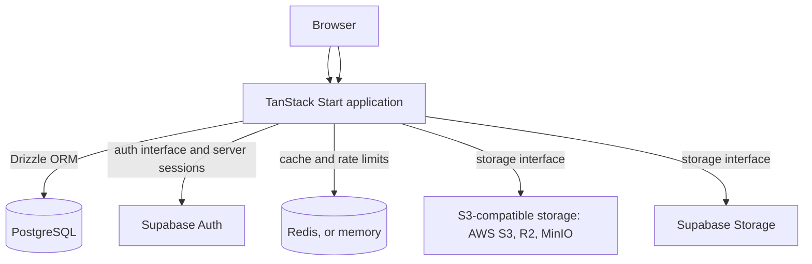

# Clubedge Starter

[](https://github.com/Clubedge/clubedge-starter/actions/workflows/ci.yml)
[](LICENSE)

Clubedge Starter is a production-oriented, modular React application foundation. It brings together a pnpm monorepo, shared shadcn/ui components, PostgreSQL access through Drizzle, replaceable infrastructure providers, and a working example dashboard. It provides engineering conventions and a reference implementation; review its security and deployment choices for your application before production use.

<!-- clubedge:if starter-repository -->

This repository contains the same application for two frameworks, Next.js (`apps/web`) and TanStack Start (`apps/start`), plus every optional module. [create-clubedge-app](https://github.com/Clubedge/create-clubedge-app) generates a project with one framework and only the modules you choose; sections of this README marked for a framework or module appear only in projects that use it. Contributions and bug reports are welcome; see [CONTRIBUTING.md](CONTRIBUTING.md). Repository maintainers can use [PUBLISHING.md](PUBLISHING.md) for the GitHub launch checklist.

<!-- clubedge:end -->

## Features

- Next.js App Router with React, TypeScript, Tailwind CSS 4, and shadcn/ui using Base UI primitives. <!-- clubedge:only framework=next -->
- TanStack Start with React, TypeScript, Vite, Tailwind CSS 4, and shadcn/ui using Base UI primitives. <!-- clubedge:only framework=tanstack-start -->
- pnpm workspaces and Turborepo, with the web app in `apps/web` and framework-agnostic packages under `packages/`.
- Drizzle ORM and PostgreSQL schema, migrations, and seed commands.
- Supabase Auth with server-verified sessions in secure cookies, a protected dashboard, and rate-limited sign-in. <!-- clubedge:only auth=supabase -->
- S3-compatible storage adapter for AWS S3, Cloudflare R2, and MinIO. <!-- clubedge:only storage=s3 -->
- Supabase Storage adapter that uses the signed-in user's session. <!-- clubedge:only storage=supabase -->
- Fixed-window rate limiter and cache on Redis, falling back to process memory without `REDIS_URL`. <!-- clubedge:only cache=redis -->
- Fixed-window rate limiter and cache in process memory, suited to a single server instance. <!-- clubedge:only cache=memory -->
- Zod environment validation, security headers, structured errors, and `/api/health`.
- Docker support, GitHub Actions CI, Vitest, Playwright, ESLint, and Prettier.

## Architecture



### Architecture principles

- **PostgreSQL is the source of truth for application data.** Drizzle centralizes application schema, queries, and migrations.
- **Authentication stays separate from application data.** The auth provider owns credentials and sessions; application tables are managed by Drizzle. <!-- clubedge:only auth!=none -->
- **Providers sit behind interfaces.** Interfaces live in `packages/{auth,storage,cache}` and each provider in its own package, so replacing a provider does not touch application code.
- **Shared packages are framework-agnostic.** Packages under `packages/` receive configuration and request cookies as arguments and never import a web framework. ESLint enforces these boundaries.
- **One composition root.** `apps/web/src/server/` is the only place that reads environment variables and chooses providers. Routes and components call it rather than a provider SDK.
- **Keep the baseline focused.** Additional providers, queues, and generator tooling should be added when a real use case calls for them.

## Quick start

### Requirements

- Node.js 22.12 or newer (Node.js 22 LTS recommended).
- pnpm 10.9.0. The repository pins its package manager version using Corepack.
- PostgreSQL when using database features.

### Install and run

```sh
corepack enable
pnpm install
```

Copy the example environment file to the web app's local environment file.

PowerShell:

```powershell
Copy-Item .env.example apps/web/.env.local
```

macOS/Linux:

```sh
cp .env.example apps/web/.env.local
```

Set `DATABASE_URL` in `apps/web/.env.local`, then start the app. [SETUP.md](SETUP.md) describes every variable and provider.

```sh
pnpm dev
```

Open <http://localhost:3000> for the landing page, <http://localhost:3000/dashboard> for the dashboard, or <http://localhost:3000/api/health> for the liveness endpoint. The pages render without connecting to providers; database and provider operations require their configuration.

## Common commands

Run these from the repository root:

| Command             | Purpose                                        |
| ------------------- | ---------------------------------------------- |
| `pnpm dev`          | Start the web app in development mode.         |
| `pnpm build`        | Create a production build.                     |
| `pnpm start`        | Start the production build.                    |
| `pnpm lint`         | Run ESLint.                                    |
| `pnpm typecheck`    | Typecheck the workspaces.                      |
| `pnpm test`         | Run Vitest.                                    |
| `pnpm test:e2e`     | Run Playwright browser checks.                 |
| `pnpm format`       | Format supported repository files.             |
| `pnpm format:check` | Check formatting without writing files.        |
| `pnpm db:generate`  | Generate Drizzle migrations from the schema.   |
| `pnpm db:migrate`   | Apply checked-in Drizzle migrations.           |
| `pnpm db:push`      | Push schema directly (local development only). |
| `pnpm db:studio`    | Open Drizzle Studio.                           |
| `pnpm db:check`     | Check migration consistency.                   |
| `pnpm db:seed`      | Seed the configured database.                  |

Playwright's first run may require installing Chromium with `pnpm exec playwright install chromium`. CI runs the browser checks automatically.

<!-- clubedge:if starter-repository -->

## Working on this repository

The TanStack Start app is `apps/start`, run with `pnpm --filter @clubedge/start dev`. It reads `apps/start/.env.local`, copied from `apps/start/.env.example`. Run the browser suite against it with `E2E_APP=start pnpm test:e2e`, and build its image with `docker build -f apps/start/Dockerfile --build-arg APP_DIR=apps/start --build-arg APP_PACKAGE=@clubedge/start .`.

`clubedge.template.json` tells create-clubedge-app what each framework and module owns: packages, files, variant files under `variants/` that replace a default, and files with `clubedge:if` blocks. Write those blocks so the default selection keeps every block; use a variant file when two options need different code. `.github/workflows/starter.yml` generates projects for several combinations and runs their full pipeline.

<!-- clubedge:end -->

## Repository structure

- `apps/web/`: the web app, with routes, UI, and the composition root in `src/server/`
- `e2e/`: Playwright browser checks
- `packages/core/`: errors, `Result` type, and HTTP helpers (no dependencies)
- `packages/db/`: Drizzle schema, client factory, migrations, and seed script
- `packages/auth/`: `AuthProvider` and `CookieStore` interfaces <!-- clubedge:only auth!=none -->
- `packages/auth-supabase/`: Supabase Auth adapter <!-- clubedge:only auth=supabase -->
- `packages/storage/`: `StorageProvider` interface <!-- clubedge:only storage!=none -->
- `packages/storage-s3/`: S3-compatible storage adapter <!-- clubedge:only storage=s3 -->
- `packages/storage-supabase/`: Supabase Storage adapter <!-- clubedge:only storage=supabase -->
- `packages/cache/`: `Cache` and `RateLimiter` interfaces with in-memory implementations
- `packages/cache-redis/`: Redis rate limiter and cache <!-- clubedge:only cache=redis -->
- `packages/ui/`: shared shadcn/ui components, utilities, and global theme styles
- `.github/`: CI workflow, issue forms, and pull request template
- `SETUP.md`, `CONTRIBUTING.md`, `SECURITY.md`: setup, contribution, and security guides

The project name, description, service identifier, and documentation links live in `apps/web/src/config/site.json`. Edit that file to rename the app; `create-clubedge-app` writes it for generated projects.

## Shared UI components

The shared component package is `@clubedge/ui`. It uses the shadcn `base-nova` style, which generates components backed by `@base-ui/react` rather than Radix UI. The landing page and dashboard demonstrate the shared sidebar, breadcrumbs, theme switch, buttons, cards, badges, separators, inputs, labels, and tables. The light/dark theme preference is stored in the browser; dark mode uses a `#151515` page background and blue `#2563eb` primary color.

Add a component from the repository root using the web app's config:

```sh
pnpm dlx shadcn@latest add badge -c apps/web
```

Shared components are generated under `packages/ui/src/components` and can be imported from `@clubedge/ui/components/<component>`. The app and `packages/ui` `components.json` files intentionally share the `base-nova` style, neutral color base, Lucide icons, Tailwind v4 stylesheet, and RTL-aware generation setting. The app currently renders English in LTR; set the root document's `lang` and `dir` for the locale used by your application. Put app-only components in `apps/web/src/components`.

## Contributing

Please read [CONTRIBUTING.md](CONTRIBUTING.md) before opening an issue or pull request. For local changes, run the relevant checks before submitting. You can report vulnerabilities privately using the process in [SECURITY.md](SECURITY.md).

## License

Copyright © 2026 Clubedge Digital Systems. This project is licensed under the Apache License, Version 2.0. See [LICENSE](LICENSE) and [NOTICE](NOTICE).
